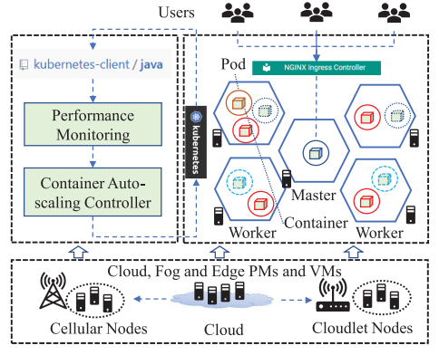

# Inverse Queuing Model-Based Feedback Control for Elastic Container Provisioning of Web Systems in Kubernetes  
# (基于逆向排队模型的反馈控制用于Kubernetes中网络系统的弹性容器供应)  

## Abstract
&emsp;&emsp;容器编排平台，例如Kubernetes和Kubernetes的派生 KubeEdge等已经逐步用于云计算、雾计算和边缘计算资源的统一管理。为了保证基于Kubernetes系统的服务质量(QoS)，容器供应算法时至关重要的。然而，大多数现有算法侧重于配置和迁移固定数量的容器，未考虑容器的弹性供应。同时，广泛应用基于线性性能模型的反馈控制或基于固定处理速率的排队模型在不同平台上无法准确描述容器化Web系统的性能。此外，在现有方法中使用的固定参考点在到达率变化较大时会产生巨大的波动，很可能产生不准确的输出误差。在这篇文章中，设计了一种基于变处理率排队模型和线性模型相结合的反馈控制方法，通过学习不同到达率的参考模型，并将参考模型的输出误差映射到排队模型，提高输出误差的准确性。在一个真实的Kubernetes集群上，将我们的算法与几种最先进的算法进行比较。实验结果表明，我们的方法获得了最低的服务水平协议(SLA)违反百分比(至少降低8.44%)和第二的最低成本。
## 1 Introduction
&emsp;&emsp;共享私有数据中心等不同系统资源最有效的方法之一就是云计算、雾计算和边缘计算在不同应用程序中正在使用的更轻量级的、比VM更容易移植的容器。Kubernetes是一种流行的容器编排系统，并逐步用于管理云计算、雾计算和边缘计算的容器资源，并导致许多衍生平台的出现，例如KubeEdge。Kubernetes的不同应用程序的Pod(一个或多个容器组成)被部署在从公共云租用的虚拟机或雾和边缘节点的物理机（PM）上。同时，网络应用和服务(统称为网络系统)在云计算、雾计算和边缘计算中非常普遍，通过以容器形式部署的不同微服务中，向终端用户提供各种功能。其中最关键的一个问题是设计容器自动缩放算法来控制基于Kubernetes的平台中每一个微服务的响应时间。  
&emsp;&emsp;大多现有容器供应算法侧重于部署和迁移虚拟机和物理机中固定数目的容器而不是容器的自动缩放。但是，分配给每一个微服务的容器数量对请求响应时间有很大的影响。Kubernetes内置的自动缩放设计和大多基于阈值的方法仅仅根据资源利用率增加或删除容器副本，而资源利用率是控制响应时间的间接指标。因此，本文的主要目标是为Kbernetes设计容器自缩放方法，自动调整给每个微服务分配的容器数量，减少资源浪费，同时保证服务质量。设计这种自缩放算法的主要挑战包括多容器系统的非线性性能模型和寻找合适的输出误差计算方法。  
&emsp;&emsp;Web系统的非线性性能特征使得资源自缩放变得复杂。QoS控制在传统Web系统中得到广泛研究，设计应用程序资源、物理机和虚拟机的弹性供应。但是，大多现有方法属于基于纯排队论的前馈控制和基于线性模型的反馈控制，这些方法缺乏反馈能力或无法准确描述复杂的非线性多容器系统。虽然，基于线性模型的反馈控制利用排队论和控制论结合的优势来修正排队模型的不准确性，但只有当系统在参考点附近时，参考点推导的线性模型才能取得良好的效果。  
&emsp;&emsp;参考点与实际响应时间之间的偏差称为输出误差，输出误差对控制性能具有很大的影响。选择合适的参考点计算输出误差有助于获得稳定的输出性能。在现有方法中，参考点通常是根据不同的到达率手动选择和保持不变。但是，一个固定的参考点有可能引起大的波动，因为不同到达率有不同的稳定工作点。同时，剖析的性能模型和真实系统之间的差异是不可避免的，这使得输出误差与剖析的性能模型不匹配。  
&emsp;&emsp;本文提出了一种基于逆排队模型的反馈控制方法在保证Kubernetes中容器化Web系统的QoS，降低了8.44%的SLA违反百分比。我们工作的主要贡献如下。  
&emsp;&emsp;1)提出一个基于变化处理率的排队模型和线性模型的混合模型，用来更准确地描述多容器系统的性能。逆排队模型用于线性化控制系统以简化控制器的设计。  
&emsp;&emsp;2)提出一个在线参考模型学习方法，为不同到达率找到适合的参考点以增加输出误差的准确度。  
&emsp;&emsp;3)提出了一种自适应输出误差映射方法，以修正采样参考模型和剖析性能模型之间的不一致，避免激烈的控制波动。  
&emsp;&emsp;本文的其余部分组织如下。第2节是相关的工作和第3节描述了Kubernetes中的web系统。第4节介绍了所提出的方法。第5节和第6节包括在一个真实的Kubernetes集群上的性能评估，结论和未来的工作。  
## 2 Related work  
&emsp;&emsp;大多数现有的容器调度工作都假设每个应用程序消耗的容器是固定的。在私有或弹性租用的底层资源上部署和迁移固定数量的容器可以被建模为一个装箱(bin-packing)问题并由CPLEX解决。对于Kubernetes，已经提出了启发式方法，如最佳拟合递减装箱(BFD)和time-bin BFD，用于容器的部署和迁移。考虑到雾计算节点的地理位置、用户移动性和违反SLA的能量消耗，强化学习和博弈论也被用于固定数目容器的部署和迁移。  
&emsp;&emsp;与分配固定数量的容器相比，提供可拓展的计算和存储能力给应用程序有助于节约资源成本和提高资源利用率。例如，[22]的作者提出了一个方案，通过细粒度的数据更新来支持云中的数据审计处理。相对于每一次小更新都需要重新计算和更新整个文件夹的固定大小的更新，它节省了大量的数据审计处理的存储和计算开销。该方案在云计算中提供了高度可伸缩的和高效的数据审计处理方法。为了给Kubernetes中的应用程序提供可伸缩的计算能力。假设每个应用程序都有一个性能下降的资源阈值，或者预先分析了为每个应用程序提供不同数量容器的效用，则使用遗传算法和线性规划在多个应用程序之间寻找最优的容器分配策略。换句话说，这些工作主要集中在竞争应用程序之间的资源分配上，而本文考虑的是一个应用程序的容器自动伸缩。由于传统应用资源的自动伸缩方法，可以通过迁移pm和vm来处理容器的自动伸缩，因此对自动伸缩技术进行了综述。  
### 2.1 QoS控制的自动伸缩  
&emsp;&emsp;阈值是最简单的自动缩放技术之一。Kubernetes内置的自动缩放调度程序根据CPU和内存使用率调账容器数量。当现有资源已经用完时，添加单个容器或者当实时响应时间远大于阈值时，添加固定数目的容器。基于阈值的方法难点在于如何选择适合不同到达率的阈值。  
&emsp;&emsp;排队模型描述了Web系统的平均响应时间、请求到达率和分配资源之间的关系。M/M/1、M/M/N、异构M/M/N排队模型和排队网络用于确保Web系统QoS的最小虚拟机或物理机的数量。然而，基于纯排队模型的方法缺少对实时输出误差作出反应的能力。  
&emsp;&emsp;反馈控制是应用程序资源自动伸缩的基本方法。基于线性性能模型的固定增益、自适应或多模型切换的反馈控制方法已经广泛应用于应用程序的自动缩放。一个比线性模型更加准确的反比例性能模型被用来设计一个反馈控制方法来自动缩放Web应用程序中的容器。排队模型比线性模型或反比例模型更加准确，并且被用于提升反馈控制的性能。例如，M/M/1排队模型派生出的线性模型被用来设计反馈控制器，描述了输出误差变化和参考点附近分配资源调整的线性关系，并且只在参考点附近取得良好效果。对于Kubernetes来说，基于M/M/1模型的反馈控制器被用来调整一个松散耦合M/M/N模型的到达率调整系数，这是为了避免因云计算虚拟机的基于时间间隔的收费模式所产生的过度控制而量身定制的。  
&emsp;&emsp;基于Q表和深度神经网络的强化学习被用来弹性分配Web系统的虚拟机或物理机。但是这种方法需要一个较长的采样和训练时间来获得良好的性能。因此，基于精准模型的方法仍是必要的，它可用来指导基于深度学习的方法。  
### 2.2 与现有算法对比  
&emsp;&emsp;表1展示了我们的方法与现有资源供应算法的比较。首先，现有的线性或排队模型派生的线性模型不能准确描述基于容器的系统的性能。相反，我们的方法采用了基于更精确的性能模型的反馈控制器，该模型是变化处理率M/M/N模型和线性模型的混合体。其次，大多数现有的工作都是使用通过经验获得的固定参考点来直接计算输出误差，然而我们采用了自动参考点识别方法和一个自适应输出误差映射方法来提高控制的稳定性。 最后，我们的方法是作为Kubernetes的用户级调度器而非模拟平台来实现的。 

<h4 align="center">表1 我们的方法与Web系统中现有资源供应算法对比</h4>  

|       Resources       |                       Problems                       |                          Objectives                          |                  Algorithms and Complexity                   |                          Platforms                           |
| :-------------------: | :--------------------------------------------------: | :----------------------------------------------------------: | :----------------------------------------------------------: | :----------------------------------------------------------: |
| Application Resources |                     Auto-scaling                     |        Absolute or relative average response time         | Liner-model-based feedback control,O(1) Queuing-model-derived liner model based hybird control,O(n2) |           single WebServer  single WebServer           |
|      VMs or PMs       |                     Auto-scaling                     |                    Average response time                     | Threshold,O(1) Reinforcement learning  Queuing models,O(n2)  Queuing-length-based feedback control,O(1) Queuing-model-arrival-rate adjusting-coefficient based hybrid control, O(n2) | Private VM clusters Private VM or PM clusters, Public Clouds,MATLAB Simulation,OpenStack, Private VM clouds CometCloud  CloudSim,Private VM clusters |
|      Containers       | Fixed containers per application  Auto-scaling | Power consumption,etc Deployment Cost of VMs Resource usage, Average response time Total network latency,etc Average response time | Deep Q-learning  CPLEX, BFD, Time-bin BFD, Greedy algorithms Threshold,O(1)   Threshold,Genetic algorithm  Simple non-liner model based feedback control,O(1) Inverse-M/M/N-model based feedback control,O(n2) | Private VM clusters  Kubernetes,Simulation  IaaS,Docker Swarm   Simulation   ECOWARE  Kubernetes(Our) |
## 3 Kubernetes中的Web系统  

&emsp;&emsp;利用基于微服务的体系结构组织不同的Web系统，具有灵活性和互操作性。这类Web系统的每一层都可以实现为一个微服务，它们在并行容器中运行，以支持大规模请求。每一个微服务都提供一个功能，并且微服务通常本封装为一个RESTful或基于SOAP的Web服务。Kubernetes被广泛用于管理包含一个Mster节点和众多Work节点的容器，如图1所示。Pod是资源管理的基本单元，由一个或多个容器组成。微服务的容器嵌在部署在Worker节点(pm或vm)上的Pods中。相同颜色的容器属于同一个微服务。相同微服务的用户请求被nginx-ingress控制器分配到并行的容器中。通过Kubernetes中的java-client-interface检测每一个微服务的实时性能，在此基础上，容器自动扩展控制器（ASC）作为一个用户级插件来实现，为每个微服务分别分配适当数量的容器。每个微服务都有自己的ASC，即采用分散的控制方法。
&emsp;&emsp;平均响应时间和资源成本是容器化Web系统的两个关键指标。在微服务的SLA中，通常定义为k%的响应时间应小于给定的阈值Wsla。由于同一微服务通常需要相同的容器，一个容器单元（CU）被定义为在一个控制区间内将一个容器分配给一个微服务的成本。本文的目的是为ASCs设计容器弹性伸缩算法，以减少CU的消耗，同时保证SLAs。  

图1  在Kubernetes中容器化Web系统的构造

## 4 提出的反馈控制方法

&emsp;&emsp;在这篇文章中，提出了一个基于逆排队模型的反馈控制方法(Feedback_InverseQM)。首先采用了基于变化处理率的M/M/N模型和线性模型的混合模型来准确描述系统。然后开发了一种自动参考模型学习方法，以产生准确的输出误差。基于性能模型和输出误差，设计了一个基于逆排队模型的积分控制器。接下来研究了一种自适应输出误差映射方法，以修正采样参考模型和剖析排队模型之间的不一致。最后，在系统不稳定的情况下，使用基于排队长度的调度方法来提供容器。  

### 4.1 基于变化处理率的性能模型

&emsp;&emsp;性能模型是反馈控制的基础。在Kubernetes中，由于调度开销的原因，一个容器的平均处理率随着请求到达率的增加而下降。基于固定处理率的传统排队模型的性能模型不能准确描述系统。使λ作为请求到达率，N代表容器数量。在本文中，每一个容器的处理速率与到达率成反比：  

$$
\mu = \mu_{b} + c/\lambda
$$
&emsp; &emsp; $\mu$是基础变化速率，$c$是$\lambda$的反比例系数，根据现存的M/M/N模型，整个系统中没有请求的概率是
$$
P_{0}=[\sum^{N-1}_{k=0}\frac{1}{k!}(\frac{\lambda}{\mu})^k+\frac{\lambda^N}{N!(1-\frac{\lambda}{N\times\mu})\mu^N}]^{-1}
$$
&emsp; &emsp;等待队列中和正在处理的请求数量的期望值为
$$
L_{s}(N,\lambda,\mu) = \frac{(\frac{\lambda}{\mu})^N\frac{\lambda}{N\times\mu}}{N!(1-\frac{\lambda}{N\times\mu})^2}P_0+\frac{\lambda}{\mu}
$$
&emsp;&emsp;请求的平均响应时间的期望是
$$
W_s(N,\lambda,\mu) = \frac{L_s(N,\lambda,\mu)}{\lambda}
$$
&emsp;&emsp;同时，当前平均响应时间也受到过去数值的影响。因此，在本文中，控制步骤$k$的平均响应时间$y_k$被定义为过去值$y_{k-1}$和$W_s(N,\lambda,\mu)$的加权组合：
$$
y_k = a\times y_{k-1} + (1-a) \times W_s(N,\lambda,\mu)
$$
&emsp;&emsp;方程(5)是基于反比例处理率(变化的处理率)的M/M/N排队模型和线性模型的混合体，方程(5)被应用于本文的性能模型。

### 4.2 自动参考模型学习  

&emsp;&emsp; 参考点对计算输出误差是至关重要的，它是反馈控制的基础。因为容器是以粗粒度配置的，所以当配置容器的数量被调整时，平均响应时间（称为稳定点）不能平稳变化，如图2所示。因此，给定的$W_{sla}$可能会离稳定点很远，并且直接使用$W_{sla}$作为参考点有可能造成大的波动应从小于$W_{sla}$的稳定点中选取合适的参考响应时间。在图2中，不同到达率的稳定点是不同的，应为每一个到达率单独寻找参考点。对于每一个$\lambda$来说，违反SLA的最大容器数量$n^r$被称为下限，它能够避免释放太多容器。对于每一个$\lambda$来说，不同数量的容器的稳定点可以从历史数据中学习。$W^T$和$n^r$可以从每一个$\lambda$的稳定点上得到。稳定点结合，$W^T$和$n^r$被称为$\lambda$的一个参考模型，其用于直到反馈控制。

&emsp;&emsp;我们提出了 一个自动参考模型学习算法(ARML)，基于$s=(n_s,\lambda_s,y_s)$形式的样本对参考模型进行剖析，其中$n_s$是容器数量，$\lambda_s$是到达率，$y_s$是平均响应时间。$M$是参考模型的集合。为了减少所研究的参考模型的数量，任何两个模型的参考到达率之间的差异应大于差距$g(e.g,5/s)$。既有相似到达率的样本应用来描述同一模型。  

&emsp;&emsp;ARML的形式描述见算法1。在弹性伸缩步骤$k$中，一个新的样本s将被收集，并试图找到一个相应的参考模型$m_k = \arg min_{m\in M} \{ \lambda_d=|\lambda_m-\lambda|,\lambda_d<g\}$。如果$m_k = null$，一个参考到达率为$\lambda$ 新的模型$m_k$会被创建并添加到集合$M$中。如果$m_k = m_{k-1}$，这意味着在两个连续的步骤之间，系统的到达率是稳定的，$s$将被按照如下方式处理。如果$y_s>W_{sla}$  and  $n_s > n^r_{m_k}$，$n_s$是一个很大的数量，这违反了SLA，并且$n^r_{m_k}$将被$n_s$替代。例如，$n^r_{m_k}=10$意味着提供10个容器会导致违反SLA，但是分配11个容器能够保证SLA。当$n_s=13$and$ y_s>W_{sla}$时获得一个新的样本,这意味着，分配13个容器不能够履行SLA。因此，13是一个新的不履行SLA的最大数量。当$y_s\leq W_{sla}$，$s$被存储在一个哈希码$h_{m_k} = <n,bt_n>$中，容器编号$n$是键，桶$bt_n$包含容器编号为$n$的样本的平均响应时间。对于每个$n$，只有最近的10个平均响应时间被存储在$bt_n$中，并且与平均值$average(bt_n)$相差大于$0.4 \times average(bt_n)$的值。然后根据每个$n$的过滤值更新$average(bt_n)$，并添加到集合$Y$中，最后，集合$Y$中第三大的值作为参考响应时间$W^r_{m_k}$。例如在图2中，当$W_{sla]}=0.1s$时，空心圆时第三大平均响应时间。不选择前两个最大的稳定点的原因是小的工作量波动可能导致违反SLA，因为前两个最大的稳定点在$W_{sla}$附近。如果$n_s \leq n^r_{m_k}$，这意味着一个，与$n^r_{m_k}$相比一个更小的或相等数量的容器能够履行SLA，$n^r_{m_k}$被更新为$n_s-1$。每当从系统中收集到一个新的样本$s$，$W^r_{m_k}$和$n^r_{m_k}$都会按照如上所述更新。只有当$n^r_{m_k}$被分配了一个值，并且hashmap中键$(h^{keys}_{m_k})$的数量大于4，模型$m_k$才是成熟的，并添加到一个成熟的模型集$M'$中。因为不成熟的模型没有足够的样本来提供适当的参考点和下限，所以它们不能被使用。

&emsp;&emsp;在$s$被添加到$m_k$中后，我们尝试找到一个成熟的参考模型$m'_k = \arg min_{m\in M'}\{\lambda_d = |\lambda_m-\lambda|,\lambda_d < g'\}$。$g'$通常被设置的比$g$大$(e.g.,20/s)$，以使成熟模型能够指导更多具有较大到达率差异的情况。只有当 $m_k$是成熟的时候，$m'_k = m_k$。

图2  在不同容器数量下，不同到达速录的平均响应次数

